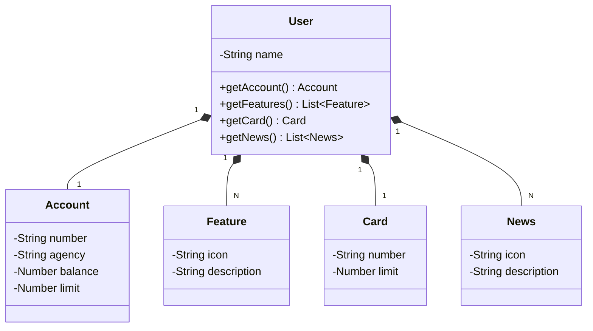

# Santander Dev Week 
Java RESTful API criada para o Santander Dev Week.

## Diagrama de Classes

```mermaid

classDiagram
    class User {
        -String name
        +getAccount() Account
        +getFeatures() List~Feature~
        +getCard() Card
        +getNews() List~News~
    }
    
    class Account {
        -String number
        -String agency
        -Number balance
        -Number limit
    }
    
    class Feature {
        -String icon
        -String description
    }
    
    class Card {
        -String number
        -Number limit
    }
    
    class News {
        -String icon
        -String description
    }
    
    User "1" *-- "1" Account 
    User "1" *-- "N" Feature 
    User "1" *-- "1" Card
    User "1" *-- "N" News

```
